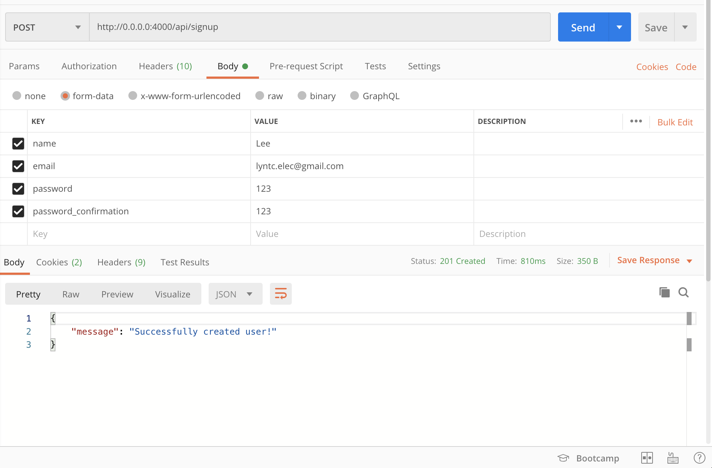
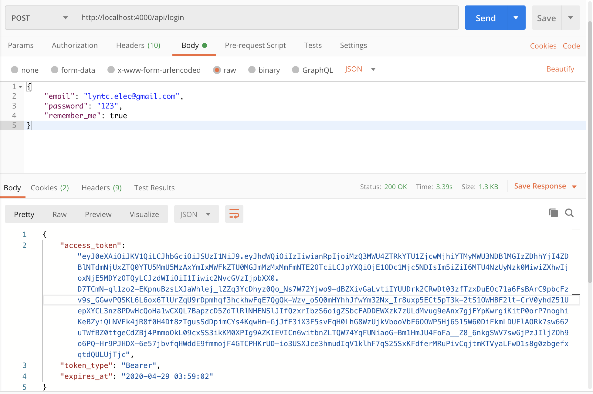
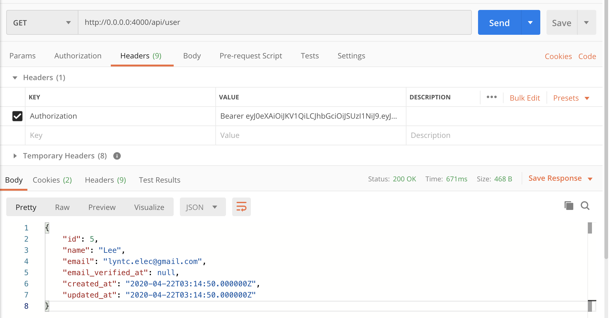
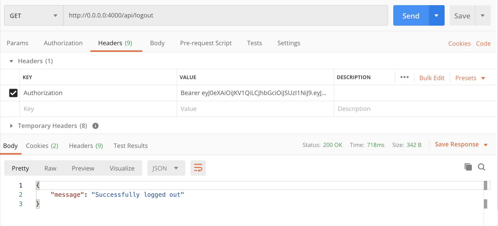

# laravel-api
## Manual setup laravel/passport
### Create laravel project
```sh
$ composer create-project laravel/laravel laravel-api --prefer-dist
$ cd laravel-api
```

### change DB_DATABASE in .env file
```sh
DB_DATABASE=laravel_api
```

### Create laravel_api database
```sh
$ mysql -u root
```
```sh
mysql> create database laravel_api;
mysql> exit;
```

### Create laravel/passport
```sh
$ composer require laravel/passport
$ php artisan migrate
$ php artisan passport:install
```

### Run example code in this repo
```sh
$ git clone https://github.com/lyntcelec/laravel-api.git
$ cd laravel-api
$ composer install
```
change DB_DATABASE in .env file
```sh
DB_DATABASE=laravel_api
```
Create laravel_api database
```sh
$ mysql -u root
```
```sh
mysql> create database laravel_api;
mysql> exit;
```
```sh
$ php artisan migrate
$ php artisan passport:install
```
Run server
```sh
php artisan serve --host=0.0.0.0 --port=4000
```

### Testing Restful API with Postman:

#### Signup


#### login


#### user


#### logout

